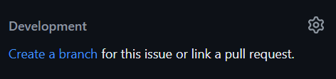
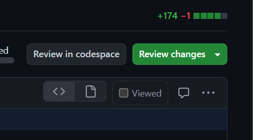

# GitHub Operations

All of our work will be stored on GitHub, so it is important to understand how to use it. 

## Table of Contents

1. [Convention](#1-convention)
    1. [Issues](#11-issues)
    2. [Branches](#12-branches)
    3. [Commits](#13-commits)
    4. [Pull Requests](#14-pull-requests)
2. [Workflow](#2-workflow)
    1. [Issues](#21-issues)
    2. [Work on the issue](#22-work-on-the-issue)
    3. [Pull Requests](#23-pull-requests)

## 1. Convention

***IMPORTANT:*** Never push directly to `main`.

### 1.1 Issues

- Each issue should be a single logical task. 

  For example, fixing a typo, adding a new feature, or refactoring a class.

- Each issue should have a descriptive title.

    The title should be in the format `<short description>`. For example, `Fix typo`.

- Each issue should have a descriptive body.

    The body should describe the task to be completed.

- Each issue should be assigned to at least one team member.

- Each issue should be labeled with at least one label.

    I will set up labels for the repository.

- Each issue should be linked to at least one milestone.

    I will set up milestones for the repository.

- Each issue should be linked to at least one project.

    In our case, the project will be EVOGAMI.

### 1.2. Branches

- `main`: The main branch of the repository. 

  This branch should always be stable -- buildable and testable.

- issue branches: Branches created for specific issues. 

  These branches should be created from `main` and merged back into `main` when the issue is resolved.

  The branch name should be `issue-<issue number>-<short description>`. For example, `issue-1-fix-typo`.

- local branches: Branches created for local testing and development.

  These branches should stay local and should not be pushed to the remote repository.

  The branch name should be `<name>-<short description>`. For example, `lance-fix-typo`.

- Always merge the latest changes from `main` into your branch before creating a pull request.

    This will help to avoid merge conflicts.

    ```sh
    git fetch origin
    git merge origin/main
    ```

### 1.3. Commits

- Each commit should be a single logical change. 

  For example, fixing a typo, adding a new feature, or refactoring a class.

- Each commit should have a descriptive commit message.
    
  The commit message should be in the format `<type> <description>`. For example, `Fix typo in README`.

    The commit message should be in the present tense. For example, `Fix typo in README` instead of `Fixed typo in README`.

    The commit message should be in the imperative mood. For example, `Fix typo in README` instead of `Fixing typo in README`.

    The commit message should be less than 50 characters. For example, `Fix typo in README` instead of `Fixed a typo in README.md and add a new line to the file which was missing`.

### 1.4. Pull Requests

- Each pull request should resolve a single issue.

    If a pull request resolves multiple issues, it should be split into multiple pull requests.

- Each pull request should have a descriptive title.

    The title should be in the format `Resolve <issue number> - <short description>`. For example, `Resolve #1 - Fix typo`.

- Each pull request should have a descriptive body.

    The body should describe the changes made in the pull request.

    I will set up a template for the pull request body.

- Each pull request should be reviewed by at least one other team member.

    I will configure the repository to require at least one review before a pull request can be merged.

    If you are reviewing a pull request, you should leave comments on the pull request.

    - For art, assign at least one art student to review the pull request.

    - For cs, assign at least one CS student to review the pull request.

    - For music, always assign Lyndon. 
    
        *To Lyndon: assign whoever you want to review your pull requests. Sorry for the inconvenience.*

- When reviewing a pull request, you should check the following:

    - The changes are correct and complete.

    - The changes are consistent with the issue description.

    - The changes are consistent with the pull request description.

    - The changes are consistent with the conventions.

    - The changes do not introduce any new issues.

    - The changes do not break any existing functionality.

- When merging a pull request, you should always

    - Check for and resolve any merge conflicts.

    - Use the "Squash and merge" option.

        You can leave the commit message as is or update it as needed.

## 2. Workflow

### 2.1. Issues

1. Create a new issue.

    - Click on the "Issues" tab.

    

    - Click on the "New issue" button.

    

    - Fill in the issue title and body.

    

    - Assign the issue to the appropriate team member.

    

    - Label the issue with at least one label.

    

    - Link the issue to a project.

    

    - Link the issue to a milestone.

    

    - Click on the "Submit new issue" button.

    

2. Work on the issue.

    - Create a new branch for the issue.

    

    - Select "checkout locally" to create a local branch.

    Double check the branch name, repository, and branch source.

    

    Then, click on the "Create branch" button.

    - GitHub will prompt you to switch to the new branch.

    ```sh
    git fetch origin
    git checkout 1-add-github-operstions-tutorial
    ```

    You can now work on the issue in your local environment.

    > *Lance*: I just realized that I made a typo in the issue title. To avoid confusion I'll leave it as is.

### 2.2 Work on the issue.

This should be familiar to you after completing the previous two tutorials.

> **Pushing and Pulling**
> - Pushing refers to sending your committed changes from your local repository to a remote repository. The `git push` command is used for this purpose.
>    ```sh
>    git push <remote> <branch>
>    ```
>    - `<remote>`: The name of the remote repository (commonly origin).
>    - `<branch>`: The name of the branch you want to push to.
>
>   Often, it is sufficient to use `git push` without specifying the remote and branch. This will push the changes to the remote repository and branch that you are currently tracking.
> - Pulling is the process of fetching changes from the remote repository and merging them into your local repository. The `git pull` command combines git fetch and git merge.
>    ```sh
>    git pull <remote> <branch>
>    ```
>    - `<remote>`: The name of the remote repository (commonly origin).
>    - `<branch>`: The name of the branch you want to pull from.
>
>   Often, it is sufficient to use `git pull` without specifying the remote and branch. This will pull changes from the remote repository and branch that you are currently tracking.
> 
> Workflow: pull, commit, push

### 2.3. Pull Requests

1. Create a new pull request.

    - Click on the "Pull requests" tab.

    

    - Click on the "New pull request" button.

    

    - Select the branch you want to merge into `main`.

    

    - Click on the "Create pull request" button.

    

    - Fill in the pull request title and body.

    

    - Assign the fields.

    > Here since I'm the only one working on this issue, I'll leave the reviewers field empty.

    

    Then, click on the "Create pull request" button.

2. Review the pull request.

    - Click on the "Files changed" tab.

    

    - Review the changes made in the pull request.

    - Leave comments on the pull request.

        Hover over the line number where you want to leave a comment and click on the "+" button.

    - Leave a comment, and/or approve the pull request if everything looks good.

    

    

    > Note that I made this PR, so I cannot approve it myself.

3. Merge the pull request.

    - Before merging, check for and resolve any merge conflicts.

       - If there are merge conflicts, GitHub will display a message.

       - Remember to always merge the latest changes from `main` into your branch before creating a pull request.

       - If you see the following message, you are free from merge conflicts.

    

    - Click on the the arrow next to "Merge pull request" button, and select "Squash and merge".

    

    

    - Click on the "Confirm squash and merge" button.

    Edit the commit message if needed.

    

    - Optional: Delete the branch after merging.